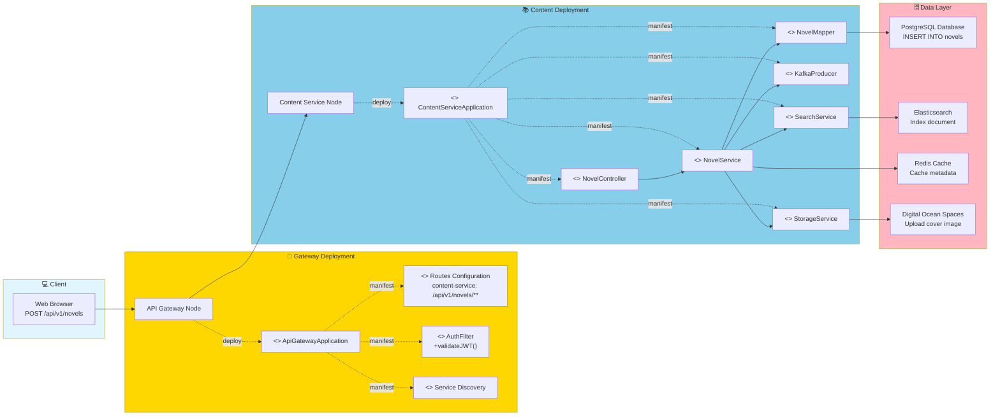
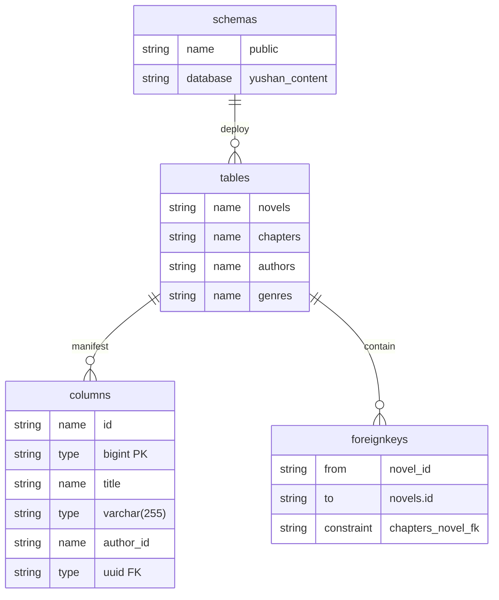
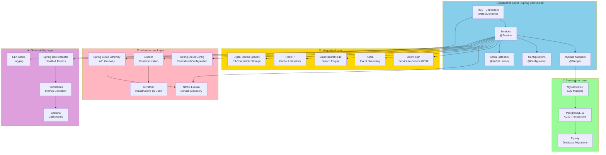
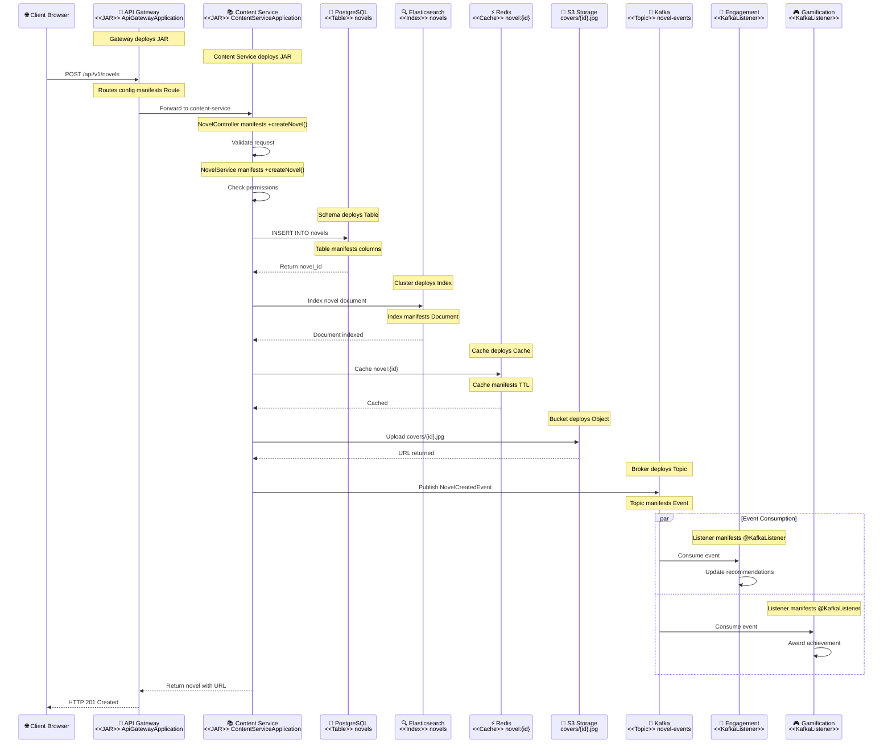

# Yushan Platform - Detail Deployment Elements (Visual/Mermaid)

## Detailed Deployment Architecture with Deployable Units

```mermaid
graph TB
    subgraph Droplets["☁️ Digital Ocean Droplets"]
        
        subgraph ContentDroplet["📚 Content Service Droplet :8082"]
            ContentJAR["<<JAR>> ContentServiceApplication"]
            
            ContentController["<<RestController>> NovelController<br/>+createNovel()<br/>+getNovel()<br/>+updateNovel()"]
            ContentService["<<Service>> NovelService<br/>+createNovel()<br/>+validateNovel()"]
            ContentMapper["<<MyBatis>> NovelMapper<br/>+insertNovel()<br/>+selectById()"]
            ContentES["<<Configuration>> ElasticsearchConfig"]
            ContentS3["<<Configuration>> S3Config"]
            ContentKafka["<<Service>> KafkaEventProducerService"]
            
            ContentJAR -.manifest.-> ContentController
            ContentJAR -.manifest.-> ContentService
            ContentJAR -.manifest.-> ContentMapper
            ContentJAR -.manifest.-> ContentES
            ContentJAR -.manifest.-> ContentS3
            ContentJAR -.manifest.-> ContentKafka
        end
        
        subgraph EngagementDroplet["💬 Engagement Service Droplet :8084"]
            EngagementJAR["<<JAR>> EngagementServiceApplication"]
            
            EngagementController["<<RestController>> CommentController<br/>+createComment()<br/>+deleteComment()"]
            EngagementService["<<Service>> CommentService<br/>+createComment()"]
            EngagementMapper["<<MyBatis>> CommentMapper<br/>+insertComment()"]
            EngagementFeign["<<FeignClient>> UserServiceClient<br/>+getUser()"]
            EngagementListener["<<KafkaListener>> NovelCreatedListener<br/>@KafkaListener"]
            
            EngagementJAR -.manifest.-> EngagementController
            EngagementJAR -.manifest.-> EngagementService
            EngagementJAR -.manifest.-> EngagementMapper
            EngagementJAR -.manifest.-> EngagementFeign
            EngagementJAR -.manifest.-> EngagementListener
        end
        
        subgraph GamificationDroplet["🎮 Gamification Service Droplet :8085"]
            GamificationJAR["<<JAR>> GamificationServiceApplication"]
            
            GamificationController["<<RestController>> GamificationController<br/>+getUserPoints()<br/>+getLeaderboard()"]
            GamificationService["<<Service>> GamificationService<br/>+awardPoints()<br/>+processUserComment()"]
            PointsMapper["<<MyBatis>> PointsMapper<br/>+insertPointsTransaction()"]
            AchievementsMapper["<<MyBatis>> AchievementMapper"]
            CommentListener["<<KafkaListener>> CommentEventListener"]
            ReviewListener["<<KafkaListener>> ReviewEventListener"]
            
            GamificationJAR -.manifest.-> GamificationController
            GamificationJAR -.manifest.-> GamificationService
            GamificationJAR -.manifest.-> PointsMapper
            GamificationJAR -.manifest.-> AchievementsMapper
            GamificationJAR -.manifest.-> CommentListener
            GamificationJAR -.manifest.-> ReviewListener
        end
        
        subgraph UserDroplet["👤 User Service Droplet :8081"]
            UserJAR["<<JAR>> UserServiceApplication"]
            
            AuthController["<<RestController>> AuthController<br/>+login()<br/>+register()"]
            AuthService["<<Service>> AuthService<br/>+login()<br/>+validateToken()"]
            UserMapper["<<MyBatis>> UserMapper<br/>+selectById()<br/>+insertUser()"]
            JWTProvider["<<Service>> JwtTokenProvider<br/>+generateToken()"]
            SessionManager["<<Redis>> SessionManager"]
            
            UserJAR -.manifest.-> AuthController
            UserJAR -.manifest.-> AuthService
            UserJAR -.manifest.-> UserMapper
            UserJAR -.manifest.-> JWTProvider
            UserJAR -.manifest.-> SessionManager
        end
        
        subgraph GatewayDroplet["🚪 API Gateway Droplet :8080"]
            GatewayJAR["<<JAR>> ApiGatewayApplication"]
            
            Routes["<<RouteConfiguration>> GatewayRoutes<br/>/api/v1/*"]
            LoadBalancer["<<LoadBalancer>> SpringCloudLoadBalancer"]
            CircuitBreaker["<<CircuitBreaker>> Resilience4jConfig"]
            ServiceDiscovery["<<EurekaClient>> ServiceDiscovery"]
            
            GatewayJAR -.manifest.-> Routes
            GatewayJAR -.manifest.-> LoadBalancer
            GatewayJAR -.manifest.-> CircuitBreaker
            GatewayJAR -.manifest.-> ServiceDiscovery
        end
        
    end
    
    subgraph Databases["🗄️ Data Storage"]
        
        subgraph PostgreSQL["🐘 PostgreSQL Database"]
            ContentTables["<<Schema>> public"]
            
            NovelTable["<<Table>> novels<br/>id, title, synopsis, author_id, status"]
            ChapterTable["<<Table>> chapters<br/>id, novel_id, title, content, order"]
            GenreTable["<<Table>> genres<br/>id, name, description"]
            
            ContentTables -.manifest.-> NovelTable
            ContentTables -.manifest.-> ChapterTable
            ContentTables -.manifest.-> GenreTable
        end
        
        subgraph Elasticsearch["🔍 Elasticsearch Cluster"]
            NovelIndex["<<Index>> novels"]
            ChapterIndex["<<Index>> chapters"]
            
            NovelDoc["<<Document>> NovelDocument<br/>id, title, synopsis, author, genres"]
            ChapterDoc["<<Document>> ChapterDocument<br/>id, novel_id, title, content"]
            
            NovelIndex -.manifest.-> NovelDoc
            ChapterIndex -.manifest.-> ChapterDoc
        end
        
        subgraph RedisCache["⚡ Redis Cache"]
            SessionCache["<<Cache>> SessionCache<br/>Keys: session:{userId}"]
            NovelCache["<<Cache>> NovelMetadataCache<br/>Keys: novel:{id}"]
            LeaderboardCache["<<Cache>> LeaderboardCache<br/>Sorted Set"]
        end
        
        subgraph KafkaBroker["📮 Kafka Broker"]
            NovelTopic["<<Topic>> novel-events"]
            CommentTopic["<<Topic>> comment-events"]
            ReviewTopic["<<Topic>> review-events"]
            
            NovelEvent["<<Event>> NovelCreatedEvent"]
            CommentEvent["<<Event>> CommentCreatedEvent"]
            ReviewEvent["<<Event>> ReviewCreatedEvent"]
            
            NovelTopic -.manifest.-> NovelEvent
            CommentTopic -.manifest.-> CommentEvent
            ReviewTopic -.manifest.-> ReviewEvent
        end
        
    end
    
    GatewayDroplet -.deploy.-> GatewayJAR
    ContentDroplet -.deploy.-> ContentJAR
    EngagementDroplet -.deploy.-> EngagementJAR
    GamificationDroplet -.deploy.-> GamificationJAR
    UserDroplet -.deploy.-> UserJAR
    
    PostgreSQL -.deploy.-> ContentTables
    Elasticsearch -.deploy.-> NovelIndex
    Elasticsearch -.deploy.-> ChapterIndex
    RedisCache -.deploy.-> SessionCache
    RedisCache -.deploy.-> NovelCache
    KafkaBroker -.deploy.-> NovelTopic
    KafkaBroker -.deploy.-> CommentTopic
    
    style ContentDroplet fill:#87ceeb
    style EngagementDroplet fill:#87ceeb
    style GamificationDroplet fill:#87ceeb
    style UserDroplet fill:#87ceeb
    style GatewayDroplet fill:#ffd700
    style PostgreSQL fill:#ffb6c1
    style Elasticsearch fill:#98fb98
    style RedisCache fill:#f0e68c
    style KafkaBroker fill:#ffd700
```

---

## Component-to-Component Flow (Create Novel)

---

## Event-Driven Communication - Kafka Topics and Consumers

```mermaid
graph TB
    subgraph Publishers["📤 Event Publishers"]
        ContentPub["Content Service<br/>KafkaEventProducerService"]
        EngagementPub["Engagement Service<br/>KafkaEventProducerService"]
        UserPub["User Service<br/>KafkaEventProducerService"]
    end
    
    subgraph KafkaNode["📮 Kafka Broker Deployment"]
        KafkaContainer["Kafka Node"]
        
        NovelTopic["<<Topic>> novel-events"]
        CommentTopic["<<Topic>> comment-events"]
        ReviewTopic["<<Topic>> review-events"]
        UserTopic["<<Topic>> user.events"]
        
        KafkaContainer -.deploy.-> NovelTopic
        KafkaContainer -.deploy.-> CommentTopic
        KafkaContainer -.deploy.-> ReviewTopic
        KafkaContainer -.deploy.-> UserTopic
        
        NovelEvent["<<Event>> NovelCreatedEvent<br/>- novelId<br/>- title<br/>- authorId"]
        CommentEvent["<<Event>> CommentCreatedEvent<br/>- commentId<br/>- userId<br/>- chapterId"]
        ReviewEvent["<<Event>> ReviewCreatedEvent<br/>- reviewId<br/>- userId<br/>- novelId<br/>- rating"]
        UserEvent["<<Event>> UserRegisteredEvent<br/>- userId<br/>- email<br/>- username"]
        
        NovelTopic -.manifest.-> NovelEvent
        CommentTopic -.manifest.-> CommentEvent
        ReviewTopic -.manifest.-> ReviewEvent
        UserTopic -.manifest.-> UserEvent
    end
    
    subgraph Consumers["👂 Event Consumers"]
        
        subgraph EngagementConsume["💬 Engagement Service"]
            EngagementJAR2["<<JAR>> EngagementServiceApplication"]
            NovelListener["<<KafkaListener>> NovelCreatedListener<br/>@KafkaListener(topics = novel-events)"]
            EngagementJAR2 -.manifest.-> NovelListener
        end
        
        subgraph GamificationConsume["🎮 Gamification Service"]
            GamificationJAR2["<<JAR>> GamificationServiceApplication"]
            CommentListener2["<<KafkaListener>> CommentEventListener<br/>@KafkaListener(topics = comment-events)"]
            ReviewListener2["<<KafkaListener>> ReviewEventListener<br/>@KafkaListener(topics = review-events)"]
            GamificationJAR2 -.manifest.-> CommentListener2
            GamificationJAR2 -.manifest.-> ReviewListener2
        end
        
        subgraph AnalyticsConsume["📊 Analytics Service"]
            AnalyticsJAR["<<JAR>> AnalyticsServiceApplication"]
            AnalyticsListener["<<KafkaListener>> AllEventsListener<br/>Consumes all topics"]
            AnalyticsJAR -.manifest.-> AnalyticsListener
        end
        
        subgraph UserConsume["👤 User Service"]
            UserJAR2["<<JAR>> UserServiceApplication"]
            UserListener["<<KafkaListener>> UserActivityListener"]
            UserJAR2 -.manifest.-> UserListener
        end
        
    end
    
    ContentPub -->|Publish| NovelTopic
    EngagementPub -->|Publish| CommentTopic
    EngagementPub -->|Publish| ReviewTopic
    UserPub -->|Publish| UserTopic
    
    NovelTopic -.->|Consume| NovelListener
    CommentTopic -.->|Consume| CommentListener2
    ReviewTopic -.->|Consume| ReviewListener2
    NovelTopic -.->|Consume| AnalyticsListener
    CommentTopic -.->|Consume| AnalyticsListener
    ReviewTopic -.->|Consume| AnalyticsListener
    
    style Publishers fill:#90ee90
    style KafkaNode fill:#ffd700
    style Consumers fill:#dda0dd
```

---

## Database Schema Deployment

---

## Complete Technology Stack Visualization

---

## Create Novel Flow - Complete Deployment View

---

## Summary

### Deployment Relationships
- **Node ──deploy──→ JAR**: Physical node deploys Java application
- **JAR └─manifest→ Component**: Application contains business logic components
- **Schema ──deploy──→ Table**: Database schema deploys tables
- **Index ──deploy──→ Document**: Elasticsearch index deploys documents
- **Topic ──deploy──→ Event**: Kafka topic deploys event types
- **Cache ──deploy──→ Key**: Redis cache deploys cache entries

### Component Manifestations
1. **Controllers**: `<<RestController>>` - HTTP endpoints
2. **Services**: `<<Service>>` - Business logic
3. **Mappers**: `<<MyBatis>>` - Database access
4. **Listeners**: `<<KafkaListener>>` - Event consumers
5. **Configs**: `<<Configuration>>` - Bean definitions
6. **Tables**: `<<Table>>` - Database entities
7. **Documents**: `<<Document>>` - Search index entries
8. **Events**: `<<Event>>` - Kafka messages
9. **Caches**: `<<Cache>>` - Redis entries

### Technology Stack
- **Application**: Spring Boot 3.4.10, Java 21
- **Persistence**: MyBatis 3.0.5, PostgreSQL 16, Flyway
- **Integration**: Kafka, Elasticsearch 8.11, Redis 7, S3
- **Infrastructure**: Eureka, Config Server, API Gateway, Docker
- **Observability**: Actuator, Prometheus, Grafana, ELK

