# Yushan Platform - Visual Deployment Diagrams (Mermaid)

## 1. Physical Deployment Architecture


---

## 2. Create Novel Use Case - Component Flow


---

## 3. Detailed Component Architecture


---

## 4. Kafka Event Flow - Create Novel Use Case

```mermaid
sequenceDiagram
    participant UI as 🖥️ Client UI
    participant GW as 🚪 API Gateway
    participant CS as 📚 Content Service
    participant DB as 🗄️ PostgreSQL
    participant ES as 🔍 Elasticsearch
    participant REDIS as ⚡ Redis
    participant S3 as 💾 S3 Storage
    participant KAFKA as 📮 Kafka
    participant ENG as 💬 Engagement
    participant GAM as 🎮 Gamification
    participant ANA as 📊 Analytics
    
    UI->>GW: POST /api/v1/novels
    GW->>CS: Route to content-service
    
    CS->>CS: Validate request
    CS->>CS: Check author permissions
    
    CS->>DB: INSERT INTO novels
    DB-->>CS: Return novel_id
    
    CS->>ES: Index novel document
    ES-->>CS: Index created
    
    CS->>REDIS: Cache novel metadata
    REDIS-->>CS: Cache confirmed
    
    CS->>S3: Upload cover image
    S3-->>CS: Return image URL
    
    CS->>KAFKA: Publish NovelCreatedEvent
    
    Note over ENG,GAM,ANA: Parallel Event Consumption
    
    KAFKA->>ENG: Consume novel-events
    ENG->>ENG: Update reading recommendations
    ENG->>ENG: Notify followers
    
    KAFKA->>GAM: Consume novel-events
    GAM->>GAM: Award "Content Creator" achievement
    GAM->>GAM: Add points to user
    GAM->>GAM: Update leaderboard
    
    KAFKA->>ANA: Consume novel-events
    ANA->>ANA: Track publishing metrics
    ANA->>ANA: Update content rankings
    ANA->>ANA: Calculate author statistics
    
    CS-->>GW: Return novel with ID and image URL
    GW-->>UI: HTTP 201 Created
    
    Note over UI: User sees new novel with cover image
```

---

## 5. Service-to-Service Communication Patterns

```mermaid
graph TB
    subgraph SyncCom["🔄 Synchronous Communication (Feign)"]
        
        subgraph EngagementService["💬 Engagement Service"]
            EC1["CommentController<br/>+createComment()"]
            EC2["ReviewController<br/>+createReview()"]
        end
        
        subgraph UserService["👤 User Service"]
            UserFeign["FeignClient<br/>getUserProfile()"]
        end
        
        subgraph ContentService["📚 Content Service"]
            ContentFeign["FeignClient<br/>getNovel(), getChapter()"]
        end
        
        EC1 -->|Feign Call| UserFeign
        EC1 -->|Feign Call| ContentFeign
        EC2 -->|Feign Call| UserFeign
        EC2 -->|Feign Call| ContentFeign
        
    end
    
    subgraph AsyncCom["📢 Asynchronous Communication (Kafka)"]
        
        subgraph Publishers["📤 Event Publishers"]
            CSPub["Content Service<br/>Publishes novel-events"]
            ESPub["Engagement Service<br/>Publishes comment-events"]
            USPub["User Service<br/>Publishes user.events"]
        end
        
        subgraph KafkaBroker["📮 Kafka Topics"]
            KafkaTopic1["novel-events<br/>chapter-events"]
            KafkaTopic2["comment-events<br/>review-events<br/>vote-events"]
            KafkaTopic3["user.events<br/>active"]
        end
        
        subgraph Consumers["👂 Event Consumers"]
            EGC["Engagement Service<br/>Consumes novel-events"]
            GMC["Gamification Service<br/>Consumes comment-events<br/>review-events<br/>vote-events"]
            ANC["Analytics Service<br/>Consumes all events"]
        end
        
        CSPub --> KafkaTopic1
        ESPub --> KafkaTopic2
        USPub --> KafkaTopic3
        
        KafkaTopic1 --> EGC
        KafkaTopic2 --> GMC
        KafkaTopic3 --> ANC
        
    end
    
    style SyncCom fill:#87ceeb
    style AsyncCom fill:#dda0dd
    style Publishers fill:#90ee90
    style Consumers fill:#ffb6c1
```



---

## 6. Infrastructure Services - Eureka & Config Server


---

## Summary of Deployment Architecture

| Service | Port | Technologies | Dependencies |
|---------|------|--------------|--------------|
| API Gateway | 8080 | Spring Cloud Gateway | Eureka |
| Config Server | 8888 | Spring Cloud Config | Git Repository |
| Eureka Server | 8761 | Netflix Eureka | - |
| User Service | 8081 | Spring Boot, MyBatis, JWT | PostgreSQL, Redis, Kafka |
| Content Service | 8082 | Spring Boot, MyBatis, Elasticsearch | PostgreSQL, Redis, Elasticsearch, S3, Kafka |
| Engagement Service | 8084 | Spring Boot, MyBatis, Feign | PostgreSQL, Redis, Kafka |
| Gamification Service | 8085 | Spring Boot, MyBatis | PostgreSQL, Redis, Kafka |
| Analytics Service | 8083 | Spring Boot, MyBatis | PostgreSQL, Redis, Kafka |

### Key Patterns:
- ✅ **Database-Per-Service**: Each service has its own PostgreSQL database
- ✅ **Event-Driven Architecture**: Asynchronous communication via Kafka
- ✅ **Synchronous Communication**: Feign clients for immediate data needs
- ✅ **Circuit Breaker**: Resilience4j for fault tolerance
- ✅ **Service Discovery**: Eureka for dynamic service location
- ✅ **Centralized Config**: Config Server for environment management
- ✅ **API Gateway**: Single entry point for all clients

